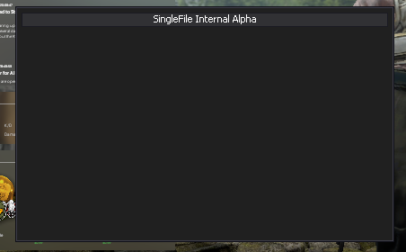
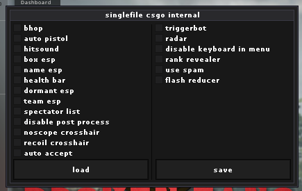

# singlefile

This is a featured CS:GO internal cheat written in less than 1000 lines, and in one C++ file. I encourage you to submit feature suggestions and issues with the cheat!

## features
* gui

* config system
* bhop
* auto pistol
* hit sound
* box esp

* name esp
* health bar
* dormant & team check for esp
* spectator list
* disable post processing
* noscope crosshair
* recoil crosshair
* auto accept
* configurable triggerbot
* radar

## config
a simple config system is included with this cheat. there is currently only one config, however we plan to expand this.. the save & load buttons operate on a config file "Counter-Strike: Global Offensive\singlefile.cfg", where the config is stored as a number.
## code style
this was programmed with the intention of being a single-file cheat, as well as a target line count of under 1000. i achieved both of these with the initial version i am posting.
